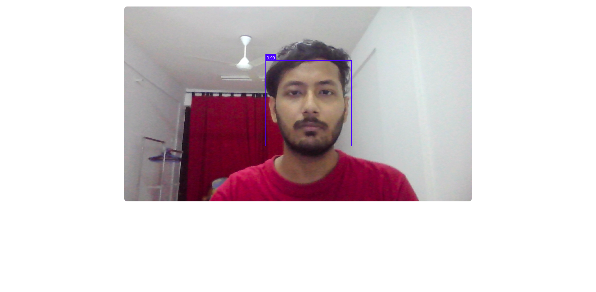

# EFFICIENT STUDENT ATTENDANCE SYSTEM USING ONE-SHOT LEARNING
This is the project repository for Visual Information Processing (TDS3651). The frontend was built with ReactJS and backend is built with FastAPI and Pytorch. The images are stored in Amazon S3 and the backend was deployed on Amazon EC2, and frontend was deployed on Vercel.

## Face Detection with MTCNN

## Confirm Image

## Results detected with Siamese Network
